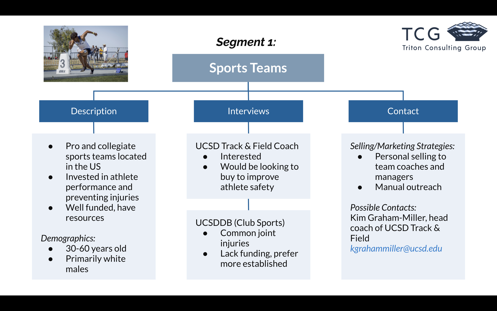
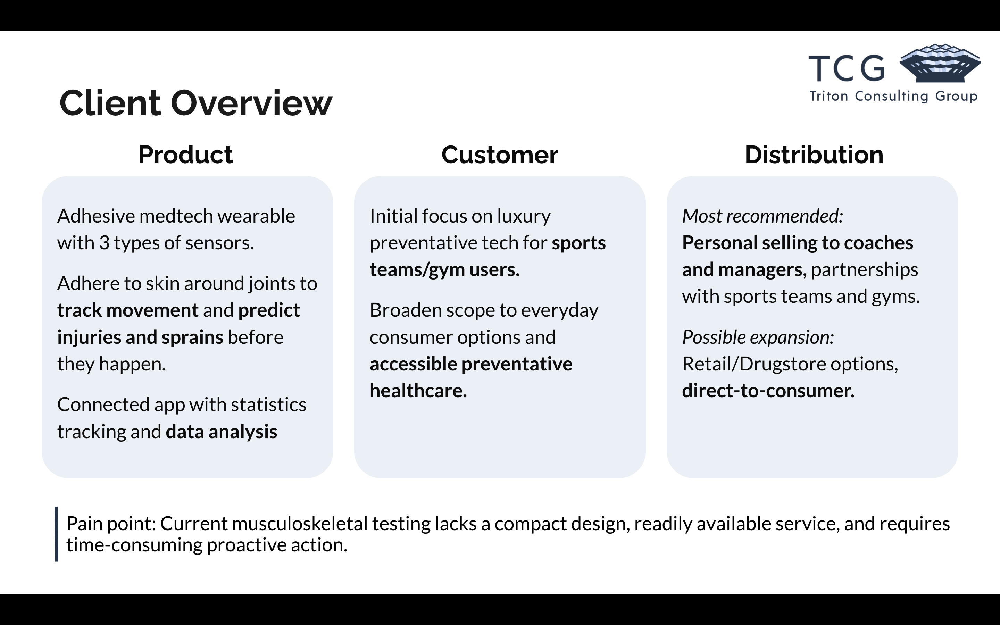
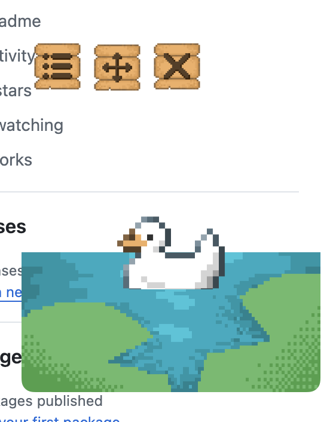
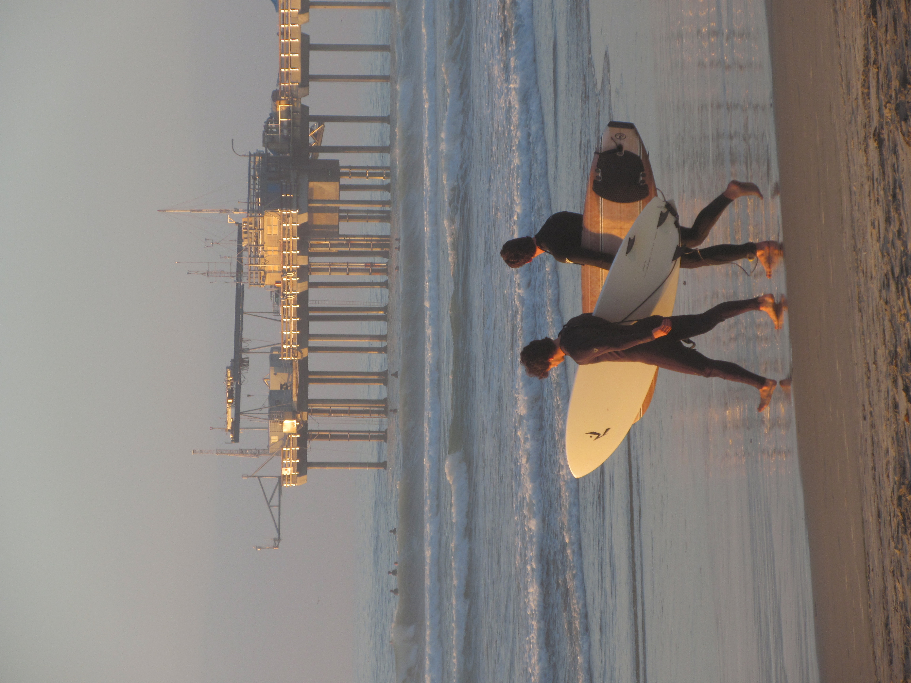
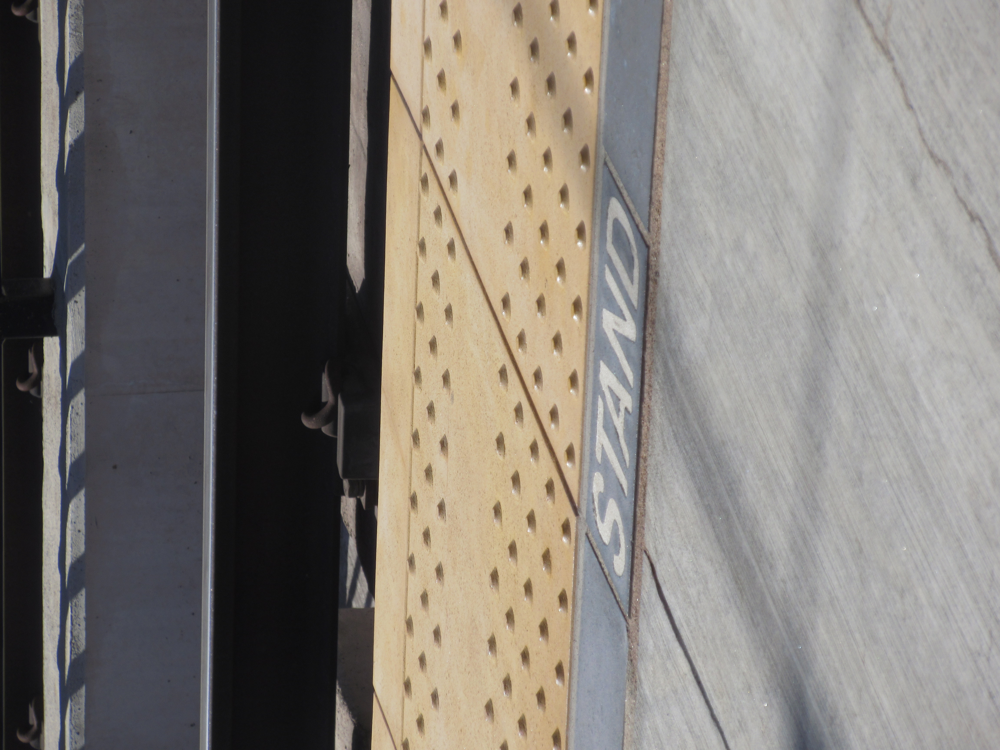

# More Information 

go back: [here](index.md)

📚 [Academics (School)](#academics) 

💻 [Resume Highlights (What I've been doing outside of school)](#highlights) 

📷 [Personal (What I like to do for fun)](#personal)

---

## Academics

Big Important Information:

* **University:** UC San Diego (_aka the best UC according to me_)

* **Major:** Computer Science (BS) 

* **Minor:** Technology, Innovation and Supply Chain Minor (basically Operations/Supply Chain, tentative)

* **GPA:** 3.9 ish (like 2 A-'s. the lifetime straight A streak holds for now)

* **Awards/other stuff:** Regents Scholarship (nerd), Provost's Honors, all quarters (nerd<sup>2</sup>)

Not much to say here. I'm a bit of an academic achiever, but so are most of the students here. I usually take a mix of Computer Science classes (DSA, SWE, Stats, etc) and Rady Management/Business Classes (Marketing, Supply Chain).

In terms of programming, most of the languages I know are from classes. For example:
* C++
* C
* ARM (sort of?)
* Java
* Python

A fun fact my code pet peeve is ridiculously long if/else trees and switch statements.

Something like this (which I actually had to write out for like 20 switches for a class):

```
switch (opcode) { 
    case HLT: 
        stat(cycle, instruction->disasm, cpu, -1, -1); 
        return true; 
    case MOV: 
        cpu->regs[dest] = op2;
        regwrit = dest;
        cpu->PC += 4;
        break;
    case ADD:
        cpu->regs[dest] = calc_add(op1, op2);
        regwrit = dest;
        cpu->PC += 4;
        break; 
    // continue for X amount of cases... 
```

It's a little dumb, but it's just such a huge pain to write (and read).

When I code, something that's really important to me is that it is very clean and consistent. When I can, I try my best to comment and make notes as much as I can. Mostly for myself, and as good practice for any future projects I might work on. 

---

## Highlights

### Triton Consulting Group (MedTech Startup)

I recently led an analyst team for my consulting club in conducting a **Market Analysis** and **Business Strategy Planning** for a MedTech startup team at the Qualcomm X Engineering Innovators and Entrepreneurs Club. 

Here are some highlights from the deliverable that I worked on! I planned out the overall structure, conducted some outreach interviews, and made reccomendations for target markets. Overall a super fun project, and taught me a lot about consulting and working with a team in general.





### ATLAS Materials Science Lab

Volunteered here for a short bit over the summer. I helped clean up and repurpose an existing codebase for a new branch of the lab project. The lab used react forms to pipe data to the Perlmutter NERSC Supercomputer to run scripts that generated ML testing environments for Polymer Research.

Mostly working in **React** and **Python**, I ended up cleaning up a lot of frontend forms, undocumented spaghetti code,and Python routing issues for this project. We worked using a team-based sprint model, which taught me a lot about collaborative development (it's rough). 

### Personal Project?

I made this little thing over the summer to test out frontend languages and design! It's just a cute little desktop sprite that sits on top of your other windows to keep you company while you study, built with a bit of **HTML, CSS, JS, and Electron**. 

Not very complex, but I had fun building and designing it! It's still a bit of a work in progress, here's what I've done so far:

- [x] Make transparent small window that stays on top of windows 
- [x] Make the small window movable + closable
- [x] Create graphics 
- [x] Test model (compile into clickable application)
- [ ] Add food/mouse interaction
- [ ] Create alternative graphics
- [ ] Cleanup codebase? (Electron has a lot of packages, I wanna see if I Have to include all of them.)
- [ ] Create social functionality (might need entire restructure)

I'm not sure if I'll actually do all of these, but it is fun to be creative and think about all the cool things you can do with a little bit of code and some illustration skills! 



---

## Personal

Basically, I like to get out of the house.

### Photography 

I grew up drawing a lot, and then decided one day, hey, why don't I pick up a camera instead?

I'm not professional by any means, I use my iPhone 14 (lol) but prefer older point-and-shoots by a long shot, even though they keep breaking on me. (RIP my Canon Elph 340 HS with 12x zoom 💔). I want to get something bigger used, maybe a Sony A5000 or like a Canon SX720? 

I like to photograph people and scenery that's really far away. 






I also sometimes like to make my photographs into posters. 


### Outdoors

I picked up running over the summer, I started with a 15 minute mile (lol) for 5ks and I've since cut down to 9 minute miles and 11 min/mi for 10ks. I've gone through three pairs of the same running shoes, it's become one of my favorite ways to pregame interviews.  

- [x] run a 5k (took me almost an hour, with breaks)
- [x] run a 5k without stopping 
- [x] run a 5k in < 35 minutes
- [ ] run a 5k in < 30 minutes (i got down to sub 33!)
- [x] run a sub 10-minute mile
- [ ] run a sub 9-minute mile 
- [x] run a 10k (1 hr+ of running)
- [ ] run a 10k without stopping
- [ ] finish a half marathon (i've gotten up to 7 miles!)
- [ ] finish a full marathon
- [x] run with a run club (did it with strides)

I like to snowboard, go to the beach, generally just stay outdoors. I love to hike, especially when there's water somewhere in the hike (bonus if I can get in it).

My top three hikes are:

1. **Santa Paula Punchbowls**
    1. Goregous 8-10 mile hike through an avocado farm and canyon
    2. Two cliff jumping/swimming spots
    3. Did it three times in one summer! Bring sunscreen and a ton of water, but so worth it!
    4. 1-2 hour drive from LA 

2. **Sky Meadows, John Muir Wilderness**
    1. Cute little 4 mile hike in the Sierras, decent elevation gain
    2. Walk right along a little lush creek, pass by gorgeous lakes and end up in an alpine meadow
    3. Did it twice with my somewhat elderly parents
    4. Make sure to take breaks to adjust to the higher elevation!

3. **Eaton Canyon**
    1. Mostly flat, easy 3-mile hike, very dog and child friendly
    2. River crossings, ends at a beautiful waterfall
    3. Did it so many times growing up I lost count
    4. It may not be open anymore after the big fires, unfortunately ☹️

### Writing 

I recently picked up writing! I post little excerpts on TikTok (good luck finding them), mostly about my life, love, and other things I've got going on. 

As someone who often feels lost, I wrote this one day, and I try to remind myself of it every day:

> <br>I think you should chase that something. <br> <br>chase that new city, chase that connection, chase that dream you've always had but never reached for. <br><br>chase that something as hard as you can.<br><br>because you can always come back home.<br> &ensp;


&ensp;
---

Anyways, thanks for stopping by! I appreciate it, and I hope your weather is always a perfect 75 and breezy. 💙
